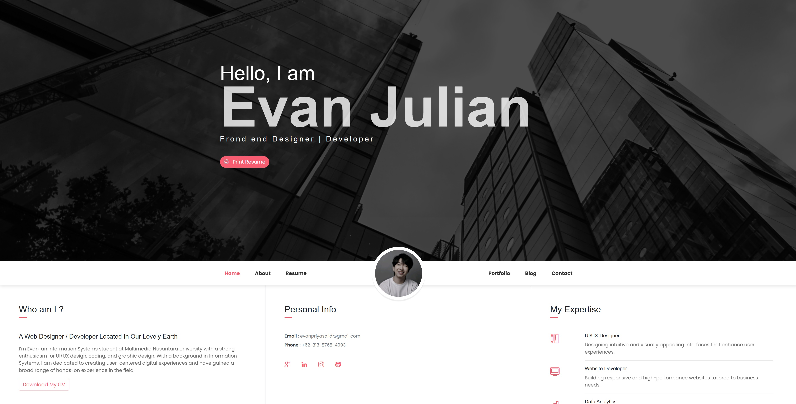

# Portofolio-Website

Welcome to my personal portfolio website! This project showcases my web development skills, highlighting projects and experiences as a web designer and developer.

## Screenshot


## Description

This portfolio website is designed to display information about myself, including:

- **My Resume**: Professional experiences, education, skills, and languages.
- **My Portfolio**: A showcase of web development projects and designs.
- **Blog**: Latest updates and articles on UI/UX design trends, website performance, and JavaScript development.
- **Contact**: Get in touch with me for collaborations and opportunities.

## Features

- Clean and modern design.
- Responsive layout for mobile and desktop.
- Smooth scrolling navigation.
- Display of various projects and skills.
- Downloadable resume.
- Contact form for inquiries.

## Installation

To run this project locally, follow these steps:

1. Clone this repository:
   ```bash
   git clone https://github.com/Evan-Julian/Portofolio-Website.git
   
2. Navigate into the project folder:
   ```bash
   cd Portofolio-Website

3.Open the index.html file in your browser to view the website:

## Technologies Used
  
- HTML5
- CSS3
- JavaScript
- Bootstrap 4 (for responsive design)
- Isotope.js (for filtering portfolio items)
- Google Fonts (Poppins)

## Contact

- Email: evanpriyasa.id@gmail.com
- LinkedIn: https://www.linkedin.com/in/evan-julian-8aa5a2292/
- GitHub: [Evan-Julian](https://github.com/Evan-Julian)

